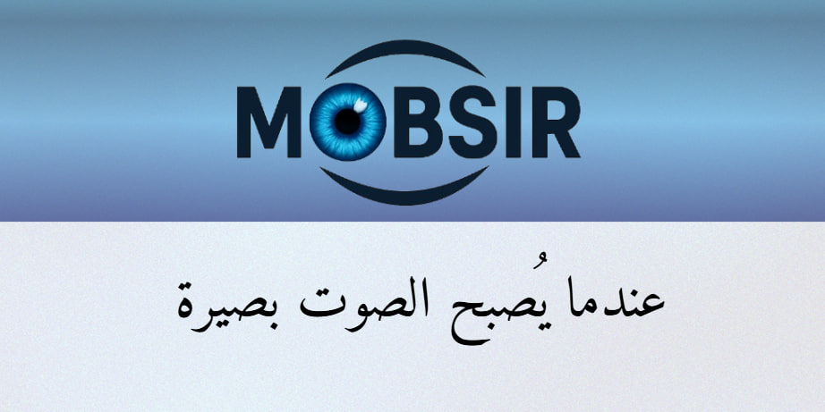

# 👁️‍🗨️ مُبصر  (عندما يُصبح الصوت بصيرة)

# **Mobsir 👀🔉**



**Mobsir** is an intelligent, voice-driven assistive system designed to empower blind or visually impaired individuals by making the world around them more accessible. Leveraging advanced computer vision, natural language processing, and Arabic voice technologies, **Mobsir** provides a seamless and interactive experience for navigating and understanding surroundings.

---

## 🎯 Project Purpose

This system is built with accessibility in mind, aiming to assist:
- 👨‍🦯 **Blind and visually impaired users** to better interact with their environment
- 👪 **Caregivers and family members** by enhancing communication and safety
- 🧪 **Researchers & developers** working on inclusive technology

Through voice commands and smart vision, Mobsir translates visual cues into rich Arabic audio feedback.

---

## ✍️ Features

- 🎤 **Arabic Voice Assistant** to receive and respond to voice commands
- 🖼️ **Image Captioning** using transformer models to describe surroundings
- 👤 **Facial Recognition** to identify known individuals (e.g., family members)
- 🔤 **English-to-Arabic Translation** for image descriptions
- 🔈 **Natural Arabic Text-to-Speech (TTS)** using Edge TTS or pyttsx3
- 🌐 **Streamlit UI** with animated microphone and voice interaction
- ⚙️ **Asynchronous Execution** for real-time, responsive interactions
- 🛡️ **Robust Fallback Handling** for smooth user experience

---

## 💡 Demo


---

## 🛠️ Tech Stack

- **Python 3.10**
- **Streamlit** for UI
- **Transformers** for image captioning
- **DeepFace** for facial analysis
- **SpeechRecognition, pyttsx3, Edge TTS** for voice interactions
- **DeepL or custom translation module** for bilingual communication

---

## 📁 Project Structure

```bash
mobsir/
├── NLP/
│   ├── __init__.py
│   ├── Voice_Assistant.py         # 🎤 Voice interaction and Arabic TTS
│   └── Translation.py             # 🔤 English → Arabic translation
│
├── Computer_Vision/
│   ├── __init__.py
│   ├── Image_Caption.py           # 🖼️ Image captioning using transformers
│   └── face_recognition.py        # 👤 Face recognition
│
├── app/
│   ├── __init__.py
│   └── main.py                    # 🖥️ Main Streamlit interface
│
├── assets/
│   ├── logo.jpg                   # 🖼️ Project logo
│   └── UI_design.png              # 📱 UI preview
│
├── requirements.txt               # 📦 Dependencies list
└── README.md                      # 📄 Documentation file
```

---

## ⚙️ Installation

Make sure Python 3.8+ is installed. Then, install dependencies:

```bash
pip install -r requirements.txt
```

---

## ▶️ Run the App

To launch the Streamlit interface, run:

```bash
streamlit run app/main.py
```

---

## 👥 Contributors
- Yasmin Kadry
- Mennatullah Tarek
- Aya Attia
- Rehab Abdelghaffar
- Nagwa Mohammed

---

## 📢 Feedback & Contact

We welcome feedback and contributions. Feel free to open issues or pull requests.

---

© 2025 Mobsir Project – Empowering through accessibility.
